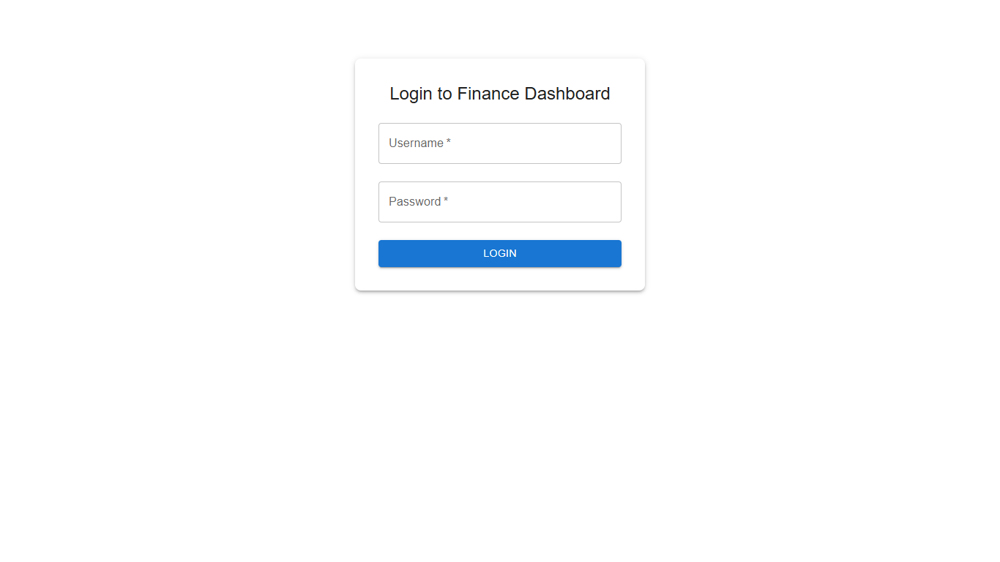
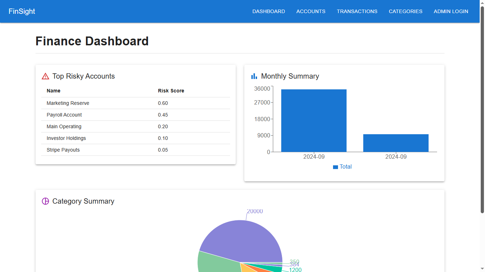
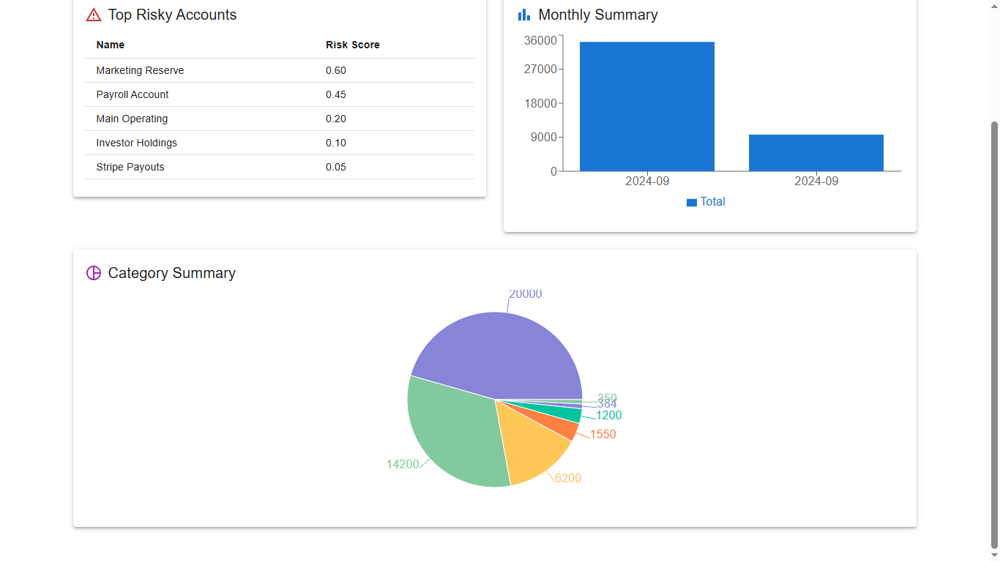
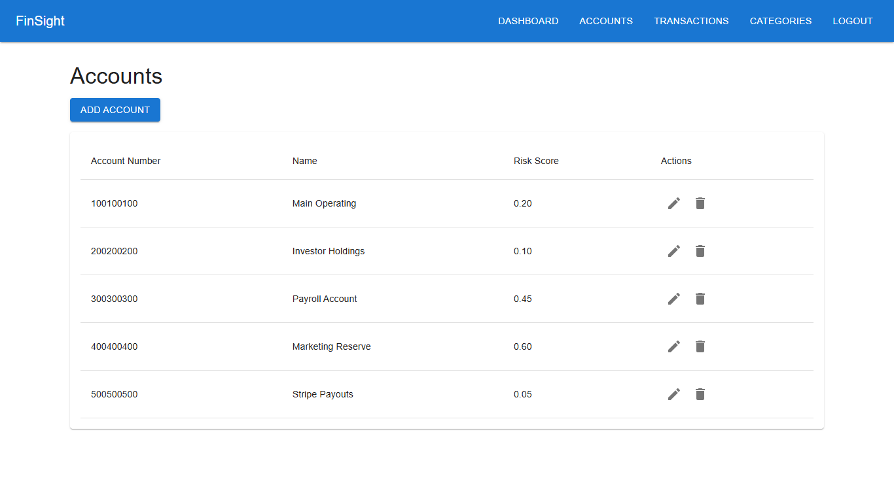
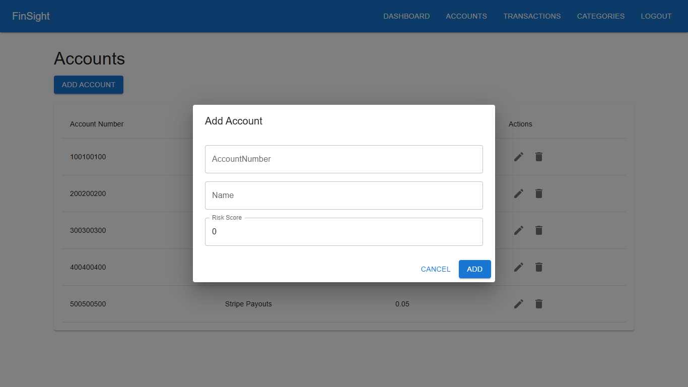
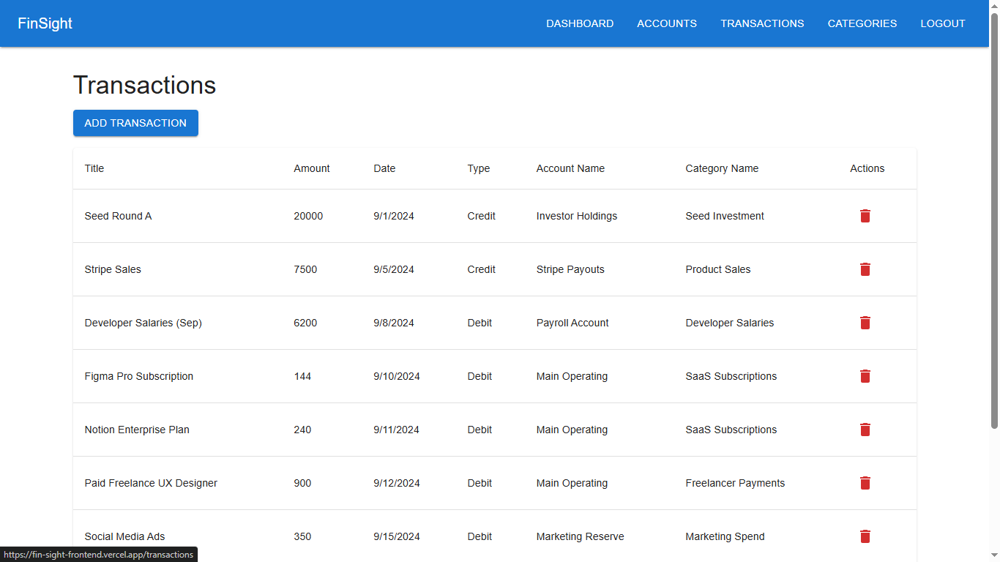
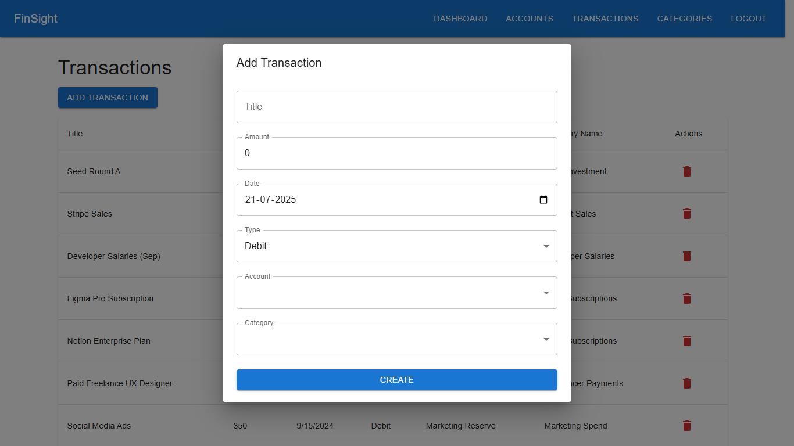
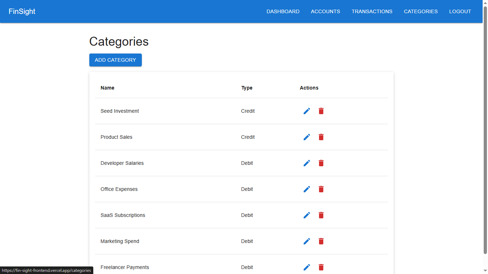
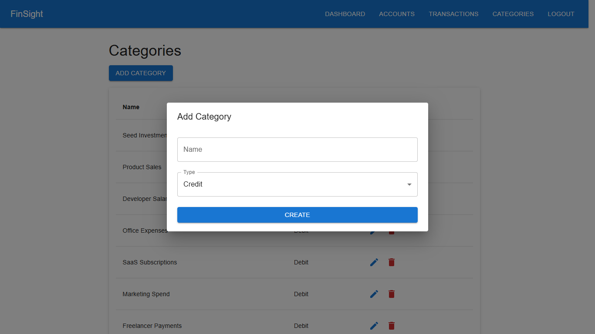

### 📊 FinanceDashboard Frontend

A responsive and interactive frontend for the FinanceDashboard project — a financial analytics dashboard that visualizes transactions, risky accounts, and category-level insights. Built with React, TypeScript, and Material UI, with admin support via JWT authentication.

### 🚀 Live Demo

👉 [View Live](https://fin-sight-frontend.vercel.app/)  
<!-- 🔐 Admin login enabled (read-only view for public users) -->

### 🖼️ Screenshots

#### Login Page



#### Dashboard View




#### Accounts View




#### Transactions View




#### Categories View




### 🛠️ Tech Stack

⚛️ React (with Vite)

🔡 TypeScript

🎨 Material UI v5

🔐 JWT Auth (admin only)

🌐 Axios for API calls

🔔 Global Toast Notifications (MUI Snackbar + React Context)

📦 Deployed on Vercel

### 📁 Features

Feature Description  
📊 Dashboard Monthly summaries, pie charts, bar graphs  
🧾 Transactions View and create financial transactions  
📂 Categories View, create, edit, and delete categories (admin only)  
🔐 Admin Authentication Only admin can access mutation routes via JWT  
🌍 Public Read Access All users can view dashboard, categories, transactions without login  
✅ Toast Notifications Realtime feedback for actions (add, delete, login, etc.)  
🧠 Clean Architecture Page-based routing, reusable components, responsive UI

### 🔧 Getting Started

📦 Install Dependencies

```
npm install
```

### ⚙️ Configure Environment

Create a .env file in root:  
env  
VITE_API_BASE_URL=https://your-backend-api-url/api

### ▶️ Run Locally

```
npm run dev
App runs at http://localhost:5173
```

🔐 Admin Access
To access add/edit/delete features, login at /login.

Username - admin  
Password -
admin123

### 📂 Folder Structure

src/  
├── api/  
├── components/  
├── context/  
├── pages/  
├── App.tsx  
└── main.tsx

### 🧾 License

This project is for personal and educational use. Feel free to fork and customize.
